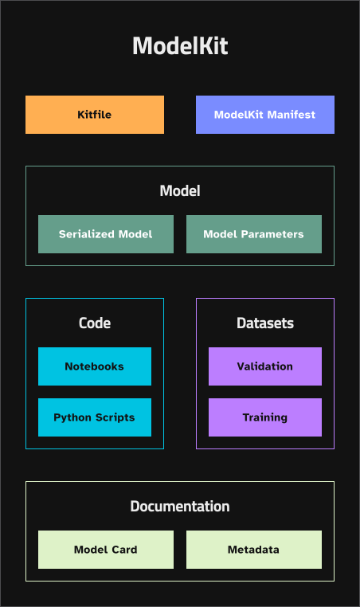

# ModelKit Overview

ModelKit revolutionizes the way AI/ML artifacts are shared and managed throughout the lifecycle of AI/ML projects. As an OCI-compliant packaging format, ModelKit encapsulates datasets, code, configurations, and models into a single, standardized unit. This approach not only streamlines the development process but also ensures broad compatibility and integration with a vast array of tools and platforms.

[Get started with ModelKits](/docs/get-started.md) in less than 15 minutes.

[See how security-conscious organization are using ModelKits](/docs/use-cases.md) with their existing tools to develop AI/ML projects faster and safer than ever before.

## Key Features of ModelKit:

**Seamless Sharing and Collaboration:** ModelKit's standardized format fosters a collaborative environment, enabling teams to share and manage AI/ML artifacts effortlessly across different stages of development.

**Wide Compatibility:** Being OCI-compliant, ModelKits can be stored, versioned, and tagged using existing infrastructure like DockerHub or GitHub Packages, leveraging familiar workflows for AI/ML artifacts and streamlining infrastructure costs.

**Efficient Artifact Management:**  Unlike traditional container images, ModelKits allow for direct addressing of included artifacts. This means tools can selectively unpack only the required datasets or code at any given stage, optimizing resource usage and speeding up development.

**Enhanced Efficiency for Shared Artifacts:** ModelKits are designed to efficiently handle shared artifacts across multiple versions. When the same dataset, for instance, are used by several ModelKits, this approach significantly reduces duplication and storage overhead.

**Built-in Versioning and Tagging:** Leveraging existing container registry infrastructure, ModelKits support sophisticated versioning and tagging strategies out of the box, something that requires additional tooling or manual management with traditional storage.

**Optimized for AI/ML Workflows:** ModelKits are tailor-made for AI/ML projects, addressing specific needs such as versioning and environment configuration.

ModelKit is not just a packaging format; it's a building block for innovation, simplifying the complexities of AI/ML development and deployment. By adopting ModelKit, teams can focus more on creating value and less on managing the intricacies of artifact storage and sharing.

**Questions or suggestions?** Drop an [issue in our GitHub repository](https://github.com/jozu-ai/kitops/issues) or join [our Discord server](https://discord.gg/Tapeh8agYy) to get support or share your feedback.
