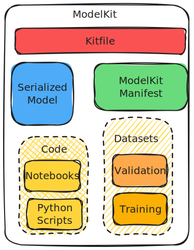

#  ModelKit Specification v0.1

A **ModelKit** represents a comprehensive bundle of AI/ML artifacts, including models, datasets, and code, along with their associated parameters. These components are crucial at various stages of a model's lifecycle. This specification details the format and organization of these artifacts and parameters, providing guidelines for their creation, management, and use.

## Terminology and Structure



**Artifacts:** The building blocks of a ModelKit. Artifacts can be models, datasets, or code, each stored and addressed individually. This modular approach facilitates direct access via tools. Artifact metadata is encapsulated within the kitfile, ensuring comprehensive documentation of each component.

The artifacts and their media types are 
* Serialized Model: `application/vnd.kitops.modelkit.model.v1.tar+gzip`
* Datasets:  `application/vnd.kitops.modelkit.dataset.v1.tar+gzip`
* Code: `application/vnd.kitops.modelkit.code.v1.tar+gzip`

**ModelKit File (Kitfile)** Acts as a record detailing the properties, relationships, and intended uses of the included artifacts. The Kitfile is central to understanding the structure and purpose of a ModelKit. It adopts the `application/vnd.kitops.modelkit.config.v1+json` media type for easy access and interpretation by tools.See the seperate kitfile specification on details

**ModelKit Manifest:** This JSON document provides essential information about the model, including creation date, authorship, and a cryptographic hash of each artifact and the Kitfile. The manifest is immutable to preserve the integrity of the ModelKitID, ensuring any modification results in the creation of a new derived ModelKit, rather than altering the existing one.

### Identification and Management:

**ModelKitID:** A unique identifier for each ModelKit, derived from the SHA256 hash of its manifest. For example, `sha256:a9561eb1b190625c9adb5a9513e72c4dedafc1cb2d4c5236c9a6957ec7dfd5a9`.

**Tag:** A tag serves to map a descriptive, user-given name to any single modelKitID. Tag values are limited to the set of characters [a-zA-Z0-9_.-], except they may not start with a . or - character. Tags are limited to 128 characters.

**Repository:** A collection of tags grouped under a common prefix (the name component before :). For example, in a ModelKit tagged with the name myllm:3.1.4, myllm is the Repository component of the name. A repository name is made up of slash-separated name components, optionally prefixed by a DNS hostname. The hostname must comply with standard DNS rules, but may not contain _ characters. If a hostname is present, it may optionally be followed by a port number in the format :8080. Name components may contain lowercase characters, digits, and separators. A separator is defined as a period, one or two underscores, or one or more dashes. A name component may not start or end with a separator.


## ModelKit Manifest Example

Example of a ModelKit manifest with a single serialized model and kitfile. 

```JSON
{
    "schemaVersion": 2,
    "config": {
        "mediaType": "application/vnd.jozu.model.config.v1+json",
        "digest": "sha256:d5815835051dd97d800a03f641ed8162877920e734d3d705b698912602b8c763",
        "size": 301
    },
    "layers": [
        {
            "mediaType": "application/vnd.jozu.model.content.v1.tar+gzip",
            "digest": "sha256:3f907c1a03bf20f20355fe449e18ff3f9de2e49570ffb536f1a32f20c7179808",
            "size": 30327160
        }
    ]
}
```